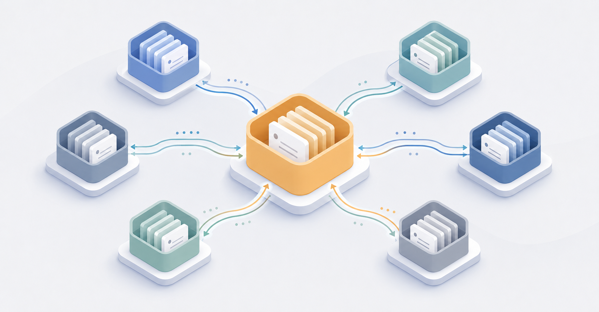

# docflow



A plugin for **ADR-driven, documentation-led projects**, working on
**Claude Code, Claude Cowork, pi, Codex, and OpenCode** from the same
skill files (see [Install](#install)).
It installs a `bootstrap` skill that scaffolds (or retrofits) an
**Architecture Decision Record (ADR)** catalogue, a plan queue, and
`AGENTS.md` conventions into any repository, plus a set of **lifecycle
skills** that author, queue, ship, and audit ADRs — so the project can
be driven by both humans and coding agents from a small set of canonical
files. For the formal definition of the conventions — why they help and
where they fall short — see the
[methodology](https://evolvehq.github.io/docflow/methodology/).

## Skills

Slash commands below are the **Claude Code** form. On the **pi** coding
agent the same skills are invoked as `/skill:<name>` (e.g.
`/skill:bootstrap`, `/skill:new-adr`). See [Install](#install).

| Skill | Slash command | Purpose |
|-------|---------------|---------|
| bootstrap | `/bootstrap` | Scaffold or retrofit the whole convention set. Start here. |
| new-adr | `/new-adr` | Author one ADR — next contiguous number, right shape, INDEX + domain wiring, supersede linkage. |
| new-spec | `/new-spec` | Author one **living capability spec** (`spec/<slug>.md`) on the decisions+specs record model — slug-identified, edited in place, human-gated `Draft`→`Agreed`. |
| new-plan | `/new-plan` | Add a `plan/todo` item tracing to its owning record(s) — ADR, or spec criterion ids where specs exist. |
| ship-item | `/ship-item` | Run the completion event: verify → **execute each criterion's `Verify:` method and write bound evidence** → integrate → `todo`→`done` → owning record → `Implemented` (only with full valid evidence) → INDEX/WORKLOG. |
| add-convention | `/add-convention` | Assess whether a convention is worth codifying, route it to the right home (or to an ADR), then add it. Use it to enable optional practices (e.g. TDD) on demand — see [USAGE §5a](USAGE.md). |
| audit | `/audit` | Lint the repo against its own conventions — numbering, INDEX sync, plan coverage, **ADR-privacy leaks**, declared-vs-computed status, evidence re-runs, the manual-verification ratio, constraints discipline, spec records. |
| brainstorm | `/brainstorm` | **The front door.** Decompose a problem into *classified* candidates — a choice → decision · a behaviour → capability record · a rule → convention · a boundary → constraint · an outcome → goal · a job → plan item — and route each to its writer on approval. Writes nothing until approved. |
| validate | `/validate` | **The verdict** *(in development — beyond the released version)*: did a goal's **measure** actually move? Gathers the reading, presents the evidence, records your verdict (achieved · execution short · hypothesis wrong · inconclusive) as an append-only outcome entry in the goal file, applies the transition. Harm is asked about separately, whatever the verdict. |
| challenge | `/challenge` | **The interrogator.** Pressure-test a draft record by rubric, or elicit the boundaries you have not written down (eight-category checklist). Advisory only — writes nothing, gates nothing, and may honestly return "solid, nothing to add". |
| agent-wave | `/agent-wave` | Orchestrate a wave of parallel worktree subagents over the queue, with checkpoint or continuous supervision. |
| rollup | `/rollup` | For a multi-repo product: aggregate every member repo's ADRs into one derived, product-wide roll-up (run from the home repo). |

The lifecycle skills all **read the capability manifest (`docflow.yml`)
and `CONVENTIONS.md` first** and honour the choices the bootstrap
recorded (record model, status lifecycle, integration model, multi-agent
mode, enabled layers). They refuse to run on an un-bootstrapped repo and
point you at `/bootstrap`.

## What `/bootstrap` installs

Only the **core** is always written; everything else is an **opt-in layer**
chosen during the assessment, so a minimal repo stays as light as a classic
ADR catalogue.

**Core (always):**
- `AGENTS.md` — hard rules for coding agents (the entry point).
- `CLAUDE.md` — one-liner re-exporting `AGENTS.md` so Claude Code picks it
  up automatically.
- `CONVENTIONS.md` — authoring rules for ADRs, naming, status lifecycle,
  audit trail, and git contract.
- `INDEX.md` — generated table of all ADRs.
- `adr/0000-template.md` — the ADR template; the catalogue starts here.
- `docflow.yml` — the capability manifest: a small machine-readable
  record of the repo's docflow shape (contract schema, record model,
  enabled layers) so tools read it instead of parsing prose.

**Optional layers (opt-in):**
- `plan/todo/` + `plan/done/` — the implementation queue (Q4a). `git mv`
  from `todo/` to `done/` is the completion event.
- `_agent/` — coordination (`ROLES`, `LOCKS`, `WORKLOG`, `CURRENT_FOCUS`,
  `HANDOFF`, optional `prompts/`). **Q5 — choose *None* to omit it.**
- `domains/<slug>/README.md` — **grouping**: per-area indexes (e.g.
  `domains/auth/`) over the flat catalogue, for navigating a large catalogue
  by area. Organisational only — ADRs keep their number; `new-adr` files
  each under its domain. Enable it when the project has distinct areas (Q7).
- `CONSTRAINTS.md` — the repo's **inviolable boundaries**, enumerated
  (`CON-1`, `CON-2`, …) so agents load them in full before any task.
  Every change to the file needs an accepted decision record; there is
  no severity — a rule that may bend is a convention instead (Q7).
- `goals/` — the repo's **3–7 active goals**, one file each *(in
  development — beyond the released version)*: front-matter id,
  title, state, horizon, review-by; Statement and Measure in the
  body; a Goals section in `INDEX.md`. Records name the goals they
  advance in `serves:` front matter; a generated `COVERAGE.md` walks
  goal → record → evidence → plan; `brainstorm` writes goal files on
  approval; the audit flags aspirations, unmeasurable goals, and
  dangling edges (Q7).
- `GLOSSARY.md`, the technology-ADR template, and project-specific hard
  rules (vendor-naming, regulated evidence, language mandate, audit-stream
  separation) — Q7/Q10.

Omitting any optional layer leaves a valid repo; a lifecycle skill that
needs an absent layer refuses cleanly and says what's missing.

**Enable a deferred layer later:** re-run **bootstrap** on the repo — it
detects your existing setup, skips the settled questions, and offers only
the optional layers you don't have yet, adding the chosen ones by merge.
(Three shortcuts: `add-convention` creates `GLOSSARY.md` on your first
shared term and `CONSTRAINTS.md` on your first boundary — the latter
gated by an accepted decision record — and `new-adr` offers to create a
`domains/<slug>/` grouping when you file an ADR under a new domain.)

**Placement:** `AGENTS.md` and `CLAUDE.md` always stay at the repository
root; everything else lives under a configurable **artefact root** —
`.docflow/` (the default), `docs/`, or the repo root — chosen at bootstrap
and recorded in `CONVENTIONS.md`. Discovery is deterministic for tools
(the same pattern as git's `.git`): a `.docflow/` directory *is* the
root; any other choice gets a one-line `.docflow` pointer file at the
repo root (`root: docs/`), written by bootstrap.

**Seed ADR:** by default, bootstrap also writes **`adr/0001`** — a first
ADR recording the decision to adopt this method (self-documenting, like the
classic "use ADRs" convention). It references `CONVENTIONS.md` for the rules
and is created `Implemented`. Decline it at sign-off if you want only the
template.

**Record models:** where capability content lives is a bootstrap
choice — **capability-first** (capability records in the ADR
catalogue; the default), **two-shape** (capability + technology
shapes), **decisions+specs** (pure decision ADRs plus living
`spec/<slug>.md` records — slug-identified, edited in place, criteria
evidenced exactly like ADR criteria; recommended for product repos
with many living requirements), or **decisions-only** (pure decisions;
capability content owned by an external system). The choice is
recorded in `docflow.yml`; re-running bootstrap never converts it.

**Trust posture and evidence:** docflow's checks are **cooperative** —
they catch honest mistakes and make drift visible; they don't
authenticate who wrote a change (teams needing tamper resistance apply
the hardening recipe in the usage guide: CI-required gate, branch
protection, protected paths). A status line is a *projection*, not a
proof: once a repo adopts per-criterion evidence, every acceptance
criterion names its verification method (`Verify:` a command,
`gate-check`, or an attested `manual`), shipping runs the methods and
writes **bound evidence records** — digest-tied to the criterion's
exact text — and "Implemented" is only valid while every current
criterion has matching proof. Edit a criterion and its old evidence
stops counting automatically.

## Why

Documentation-led projects rot when conventions live in someone's head.
This plugin makes the conventions explicit, machine-readable, and
applied uniformly — so a fresh contributor (human or agent) can pick up
the repo with no oral handover.

It works equally well on **fresh repos** (scaffolds from zero) and on
**existing repos** (retrofits, preserving and merging existing files
rather than overwriting them).

## Multi-repo products

A single product spread across several repositories can run as a
**federation**. At bootstrap a repo declares whether it is standalone or
part of a multi-repo product, and whether it is **establishing** a new
federation or **joining** one — a joining repo only ever writes its own
back-pointer, never into another repo. You pick a **topology** (central
decisions repo · distributed · home-repo-plus-local), and the convention
set keeps numbering contiguous **per repo** while a federation-wide
identity is the cross-repo key. The `rollup` skill aggregates every
member's catalogue into one product-wide view, and `audit` gains
cross-repo checks (membership, identity collisions, dangling references,
roll-up drift, convention drift). Work and status cross repos the same way:
a cross-repo decision is one plan item per affected repo, and its aggregate
status ("2 of 3 repos") surfaces in the roll-up. No tool writes across a
repo boundary; consistency is declared at the edges and enforced by audit. See the
[methodology](https://evolvehq.github.io/docflow/methodology/#5-scaling-to-many-repositories)
for the full model.

## No drafts in the catalogue

docflow records **outcomes, not work-in-progress**. There is **no `Draft`
status** and **no `brainstorming/` folder** — an ADR's first persisted
status is `Proposed`, created only once a decision is approved. The
`brainstorm` skill explores candidates **in conversation and writes
nothing** until you approve them; only then does `new-adr` mint a numbered
ADR. This keeps the catalogue free of half-formed drafts and the numbering
clean — numbers go only to real decisions — following the lightweight-ADR
tradition that an ADR captures the agreed decision, not the discussion that
produced it.

## Install

docflow ships from **one skill source** (`plugins/docflow/skills/`) to
five coding agents — only the packaging differs. Two surfaces: the scaffolded **output**
(`AGENTS.md`, the ADR catalogue, `plan/`, `_agent/`) is plain Markdown
read natively by any agent that loads `AGENTS.md`; the **skills** are
`SKILL.md` files the host discovers.

| Agent | Output | Skills | Install | Invoke |
|-------|:------:|:------:|---------|--------|
| Claude Code | native | ✅ | marketplace (below) | `/bootstrap` |
| Claude Cowork | native | ✅ | same Claude Code plugin | `/bootstrap` |
| pi | native | ✅ | `pi install npm:@evolvehq/docflow` | `/skill:bootstrap` |
| Codex | native | ✅ | `codex plugin marketplace add EvolveHQ/docflow` | `$bootstrap` / `/skills` |
| OpenCode | native | ✅ | auto-discovered, or symlink into `~/.config/opencode/skills` | auto, by description |

Handy: OpenCode also reads `~/.claude/skills/` and `~/.agents/skills/`, so
a shared skills directory can serve it alongside another agent.

### Claude Code — from this marketplace

```
/plugin marketplace add EvolveHQ/docflow
/plugin install docflow@evolvehq
```

Invoke with `/bootstrap`, `/new-adr`, `/ship-item`, … (auto-triggers on
matching requests too).

### Claude Cowork

Cowork uses the **same plugin system** as Claude Code, so install the
docflow plugin exactly as above (`/plugin marketplace add
EvolveHQ/docflow`, then install) — or from Anthropic's community
marketplace once listed. No separate packaging.

### pi coding agent

```
pi install npm:@evolvehq/docflow
```

or, from source, `pi install git:github.com/EvolveHQ/docflow`. Pi
auto-discovers the skills via the `pi.skills` key in
`package.json`. Invoke with `/skill:bootstrap`, `/skill:new-adr`,
`/skill:ship-item`, … Pi does **not** auto-trigger skills from their
descriptions the way Claude Code does — invoke them explicitly (the
agent will also load a skill on-demand when a task clearly matches).

The scaffolded output (`AGENTS.md`, `CONVENTIONS.md`, the ADR catalogue,
`plan/`, `_agent/`) is plain Markdown and is read natively by pi's
hierarchical `AGENTS.md` loading — no porting needed.

### Codex (OpenAI)

docflow ships a Codex plugin (`.codex-plugin/`), so it's a one-command
install from this repo's marketplace:

```
codex plugin marketplace add EvolveHQ/docflow
codex plugin add docflow@evolvehq
```

Codex reads the scaffolded `AGENTS.md` natively. Invoke with `$bootstrap`
/ `/skills`, or just describe the task (Codex auto-triggers from the skill
description); the assessment questions fall back to plain `A/B/C` text
where there is no select tool. Update later with `codex plugin
marketplace upgrade`.

### OpenCode (sst)

OpenCode auto-discovers skills from `.claude/skills`, `.agents/skills`,
and `.opencode/skills` (project and global) — so **if you already run
docflow on Claude Code or Codex via a shared skills directory, OpenCode
picks it up with no extra step.** Standalone, symlink the skills into
OpenCode's global directory (one command, stays in sync with the clone):

```
git clone https://github.com/EvolveHQ/docflow ~/.docflow-src
ln -s ~/.docflow-src/plugins/docflow/skills/* ~/.config/opencode/skills/
```

OpenCode has no marketplace command for `SKILL.md` skills (its plugin
system is for npm JS plugins), so a shared skills directory is the clean
path. Skills auto-load by description.

**OpenCode-compatible forks** — e.g. Xiaomi's *mimocode* — inherit this
support via the same skill-discovery path; no separate packaging.

### Claude Code — local development (no install)

```
claude --plugin-dir <path-to-this-repo>
```

### Direct skill clone (no plugin lifecycle)

```
git clone https://github.com/EvolveHQ/docflow ~/.docflow-src
ln -s ~/.docflow-src/plugins/docflow/skills/* ~/.claude/skills/
```

On Windows, copy `plugins\docflow\skills\*` into
`%USERPROFILE%\.claude\skills\` instead of symlinking.

## Quick start

In any repo, run:

```
/bootstrap
```

or just say *"set up documentation-led conventions in this repo"*,
*"bootstrap ADRs and a plan queue"*, or *"scaffold AGENTS.md and the
_agent/ layout"*. The skill auto-triggers on those phrasings.

The skill will:

1. Detect whether the repo is fresh or existing, and state which.
2. Ask how deep to go — **express** (one question, conservative
   defaults, minimal footprint), **guided** (only the hard-to-reverse
   choices: integration model, coordination mode, plan queue), or
   **full** (all 10 assessment questions) — then ask that tier's
   questions one at a time, with a recommended option for each. You
   can switch depth mid-way ("defaults from here" / "go deeper"), and
   the choice is remembered as the recommendation for next time.
3. Summarise the resulting plan and ask for sign-off.
4. Write (or Edit, for existing repos) the files.
5. Commit each logical group with a Conventional Commit message.
6. **On existing repos** — and re-runnable later to **capture a large
   development that bypassed the process** — offer to backfill ADRs,
   `plan/done/`, and `CONVENTIONS.md` additions from the existing code and
   git history — drafts only, approved in batches. A reconstructed decision
   lands at `Implemented` with a matching `plan/done`; `/audit`'s coverage
   check surfaces undocumented work to capture.

## Updating

Recipients refresh installations with:

```
/plugin marketplace update evolvehq
/plugin install docflow@evolvehq
```

See [USAGE.md §Updating the plugin](USAGE.md#8-updating-the-plugin)
for the author-side flow (version bumps, release tags) and recipient
options including `/reload-plugins` for live sessions.

## Full usage and customisation guide

See [USAGE.md](USAGE.md) for the assessment questions, what each
answer changes, the file-by-file output, the backfill flow, and how
to extend or override the templates.

## Layout

```
docflow/
  .claude-plugin/marketplace.json   # Claude Code / Cowork marketplace (-> ./plugins/docflow)
  .agents/plugins/marketplace.json  # Codex marketplace (-> ./plugins/docflow)
  package.json                      # pi manifest (pi.skills -> ./plugins/docflow/skills) + npm
  plugins/docflow/                  # the plugin — one source, every target
    .claude-plugin/plugin.json      #   Claude Code / Cowork plugin manifest
    .codex-plugin/plugin.json       #   Codex plugin manifest (skills -> ./skills)
    skills/                         #   the one skill source
      bootstrap/
        SKILL.md                    #   bootstrap: assessment + output sequence + backfill
        templates/                  #   files the bootstrap reads and writes into target repos
      new-adr/SKILL.md              #   lifecycle skills — operate on a bootstrapped repo,
      new-spec/SKILL.md             #     read docflow.yml + CONVENTIONS.md, honour their choices
      new-plan/SKILL.md
      ship-item/SKILL.md
      add-convention/SKILL.md
      audit/SKILL.md
      brainstorm/SKILL.md
      challenge/SKILL.md
      agent-wave/SKILL.md
      rollup/SKILL.md
  README.md
  USAGE.md
```

Only the `bootstrap` skill uses `plugins/docflow/skills/bootstrap/templates/`. The
lifecycle skills act on the copies the bootstrap wrote into the target
repo (e.g. its `adr/0000-template.md`), so they carry no templates of
their own.

## License

MIT. Use it, fork it, change it. If you improve a template, a PR is
welcome.
