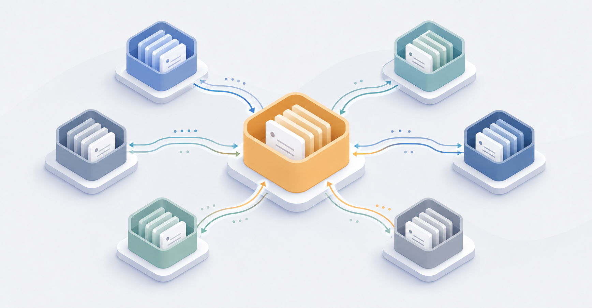

**docflow** turns any repository into a **documentation-led, ADR-driven**
project. A `bootstrap` skill scaffolds (or retrofits) an **Architecture
Decision Record (ADR)** catalogue, a `plan/` work queue, `AGENTS.md`
conventions, and multi-agent coordination files — the small set of canonical
files a repo can be driven from by humans and coding agents alike. A set of
**lifecycle skills** then author, queue, ship, and audit ADRs.

It runs on **five coding agents** — Claude Code, Claude Cowork, pi, Codex,
and OpenCode — from the same skill files, and scales from a single
repository to a **multi-repo product**. See the
[methodology]({{ '/methodology/' | relative_url }}) for the formal definition of the conventions,
why they help, and where they fall short.

## Skills

| Skill | Purpose |
|-------|---------|
| `bootstrap` | Scaffold or retrofit the whole convention set. Start here. |
| `new-adr` | Author one ADR — next contiguous number, right shape, INDEX + domain wiring, supersede linkage. |
| `new-plan` | Add a `plan/todo` item tracing to its owning ADR(s). |
| `ship-item` | Run the completion event: verify → integrate → `todo`→`done` → ADR `Accepted`→`Implemented` → INDEX/WORKLOG. |
| `add-convention` | Assess whether a convention is worth codifying, route it to the right home, then add it (e.g. enable TDD on demand). |
| `audit` | Lint the repo against its own conventions — numbering, INDEX sync, plan coverage, ADR-privacy leaks, and more. |
| `brainstorm` | Decompose a problem into candidate ADRs + plan items (proposes drafts; writes nothing until approved). |
| `agent-wave` | Orchestrate a wave of parallel worktree subagents over the queue. |
| `rollup` | For a multi-repo product: aggregate every member repo's ADRs into one derived, product-wide roll-up (run from the home repo). |

## Install

### Claude Code — from this marketplace

```
/plugin marketplace add EvolveHQ/docflow
/plugin install docflow@evolvehq
```

Then `/bootstrap`, `/new-adr`, `/ship-item`, … (skills also auto-trigger on
matching requests).

### pi coding agent

```
pi install git:github.com/EvolveHQ/docflow
```

Invoke as `/skill:bootstrap`, `/skill:new-adr`, …

### Also: Claude Cowork, Codex, OpenCode

docflow runs from the same skill files on **Claude Cowork** (the Claude
Code plugin), **Codex** (`codex plugin marketplace add EvolveHQ/docflow`;
invoke `$bootstrap`), and **OpenCode** (reads `.claude`/`.agents`/
`.opencode` skills — auto-discovered; OpenCode-compatible forks like
Xiaomi's *mimocode* inherit this via the same path). See the
[full install matrix](https://github.com/EvolveHQ/docflow#install).

## Why

Documentation-led projects rot when conventions live in someone's head.
docflow makes them explicit, machine-readable, and applied uniformly — so a
fresh contributor (human or agent) can pick up the repo with no oral
handover. It works on fresh repos (scaffolds from zero) and existing ones
(retrofits, preserving and merging rather than overwriting).

## Links

- [Methodology — the formal definition]({{ '/methodology/' | relative_url }})
- [Source on GitHub](https://github.com/EvolveHQ/docflow)
- [README](https://github.com/EvolveHQ/docflow/blob/main/README.md)
- [Full usage & customisation guide (USAGE.md)](https://github.com/EvolveHQ/docflow/blob/main/USAGE.md)

---

MIT licensed · maintained by [EvolveHQ](https://github.com/EvolveHQ) · [Privacy Policy](privacy/)
